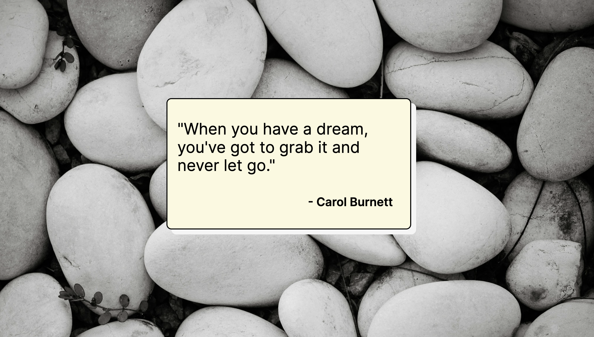

# Inspirational Quote Page

This project was created as a solo project for Module 2 of the Scrimba Frontend Developer bootcamp. It is a simple web page that displays inspirational quotes along with their authors. Each time the page is refreshed, a random quote and background image are displayed. The quote box is clickable, allowing users to visit a specified URL (in this case, the Scrimba homepage!) in a new tab.

## Demo

[View Demo](https://inspo-quote-duckie.netlify.app/)

## What I Learned

During the development of this project, I learned:

- How to structure a simple web page using HTML, CSS, and JavaScript.
- How to dynamically update content on a web page using JavaScript.
- How to style HTML elements using CSS to create an aesthetically pleasing layout.
- How to add interactivity to web pages using JavaScript event listeners.

## Credits

This project was created as part of the [Scrimba](https://www.scrimba.com/) Frontend Developer bootcamp.

The inspirational quotes used in this project were sourced from various authors.

The background images used in this project were sourced from Unsplash.

## License

This project is licensed under the [MIT License](LICENSE).
